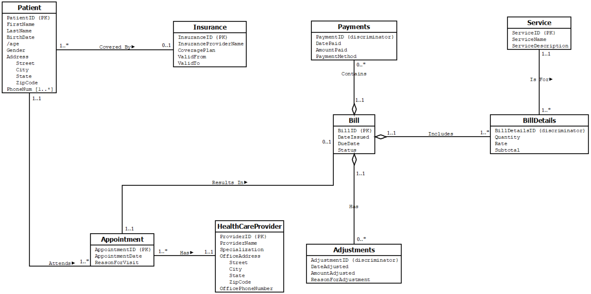

# Healthcare Management System Database Project

## Table of Contents
- [Project Overview](#project-overview)
- [Team Members](#team-members)
- [Key Components](#key-components)
  - [Requirements](#requirements)
  - [ER Model](#er-model)
  - [Database Schema](#database-schema)
  - [Data Dictionary](#data-dictionary)
  - [DDL (Data Definition Language)](#ddl-data-definition-language)
  - [DML (Data Manipulation Language)](#dml-data-manipulation-language)
  - [Queries](#queries)
- [How to Use](#how-to-use)
- [License](#license)
- [Acknowledgements](#acknowledgements)

## Project Overview
The Healthcare Management System Database Project aims to design and implement a relational database for a small but rapidly expanding healthcare group. The primary objective is to automate the production of patient bill reports, which are currently prepared manually.

## Team Members
- Caleb Miller
- Hashim Afzal
- Salma Hasan

## Key Components

### Requirements
The database captures essential information for managing:
- Patients
- Insurance plans
- Healthcare providers
- Appointments
- Bills
- Services
- Payments
- Adjustments

### ER Model
An entity-relationship model visualizes the relationships between the entities such as patients, providers, appointments, bills, and services.

### Database Schema
The schema defines the structure of the database, including tables and relationships:

- **Patient(<u>PatientID</u>, FirstName, LastName, BirthDate, Gender, Address, PhoneNum, InsuranceID)**
  - **InsuranceID** FK from Insurance table

- **Insurance(<u>InsuranceID</u>, InsuranceProviderName, CoveragePlan, ValidFrom, ValidTo)**
  - Removed policy number and made InsuranceID represent policy number to remove candidate key

- **Appointment(<u>AppointmentID</u>, AppointmentDate, ReasonForVisit, PatientID, ProviderID)**
  - **PatientID** FK from Patient Table
  - **ProviderID** FK from HealthCareProvider table

- **HealthCareProvider(<u>ProviderID</u>, ProviderName, Specialization, OfficeAddress, OfficePhoneNumber)**
  - Office addresses have multiple phone numbers for different providers/suites, avoiding transitive dependency

- **Bill(<u>BillID</u>, DateIssued, DueDate, Status, AppointmentID)**
  - **AppointmentID** FK from Appointment table

- **Adjustments(<u>AdjustmentID</u>, <u>BillID</u>, DateAdjusted, AmountAdjusted, ReasonForAdjustment)**
  - **BillID** FK from Bill table

- **Payments(<u>PaymentID</u>, <u>BillID</u>, DatePaid, AmountPaid, PaymentMethod)**
  - **BillID** FK from Bill table

- **BillDetails(<u>BillDetailID</u>, <u>BillID</u>, Quantity, Rate, Subtotal, ServiceID)**
  - **BillID** FK from Bill table
  - **ServiceID** FK from Service table

- **Service(<u>ServiceID</u>, ServiceDescription)**
  - Removed service name to avoid candidate key
  - The same service can cost different amounts depending on the complexity of the procedure, avoiding transitive dependency

### Data Dictionary
Provides detailed descriptions of each attribute in the tables, including data types, constraints, and relationships.

### DDL (Data Definition Language)
DDL scripts create the tables and define constraints to ensure data integrity and consistency.

### DML (Data Manipulation Language)
DML scripts include SQL statements for inserting sample data into the tables for testing and demonstration purposes.

### Queries
A set of SQL queries demonstrate how to retrieve specific information from the database:
- Amount due for a specific patient
- Office address of a healthcare provider
- Appointments on a particular date for a specific provider
- Gross amount of a specific service over a period
- Payments made by a patient towards a bill
- Adjustments made to a bill for a specific reason
- Office addresses for providers with a specific specialization
- Patients without insurance coverage

## How to Use
1. **Set Up the Database**: Use the provided DDL scripts to create the database schema.
2. **Populate the Database**: Run the DML scripts to insert sample data.
3. **Run Queries**: Execute the provided SQL queries to fetch required information and generate reports.

## License
This project is licensed under the MIT License - see the [LICENSE](LICENSE) file for details.

## Acknowledgements
This project was developed as part of the coursework for INFO 605: Database Management Systems. Special thanks to our instructor, Stephen Frein, for his support and feedback.

---

For more detailed information, refer to the project report: [INFO605_Term_Project_Final.pdf](INFO605_Term_Project_Final.pdf).
